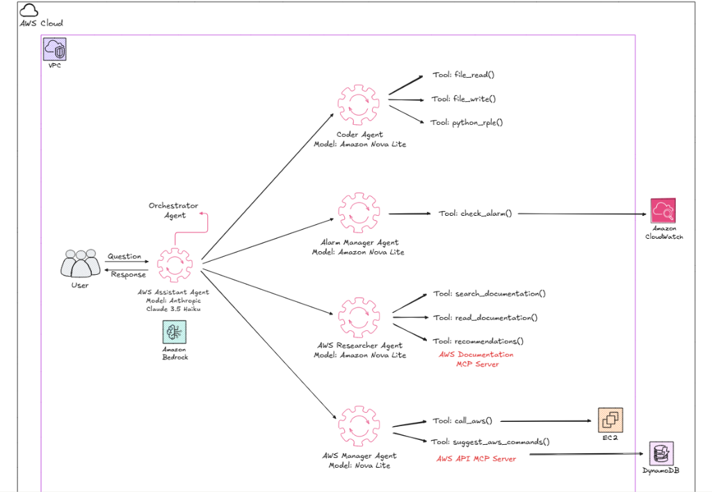

# AWS DevOps AI Assistant 🤖☁️



## Overview
The **AWS DevOps AI Assistant** is an autonomous multi-agent system designed to manage, monitor, and troubleshoot AWS infrastructure using natural language.

Built with **Python**, **Amazon Bedrock**, and **Terraform**, this project demonstrates a modern approach to DevOps automation where AI agents collaborate to solve complex operational tasks.

## 🏗️ Architecture

The system follows a **Hub-and-Spoke Multi-Agent Architecture**:

*   **Orchestrator (The Hub):** Powered by **Claude 3.5 Sonnet**. It analyzes user requests, breaks them down into steps, and delegates tasks to specialized agents.
*   **Specialized Agents (The Spokes):** Powered by **Claude 3 Haiku** for speed and efficiency.
    *   🔍 **Researcher:** Connects to the **AWS Documentation MCP Server** to fetch real-time best practices.
    *   🛠️ **AWS Manager:** Executes infrastructure changes (EC2, DynamoDB) using `boto3`.
    *   💻 **Coder:** Writes and executes Python/Bash scripts for automation and debugging.
    *   🚨 **Alarm Manager:** Monitors CloudWatch alarms and system health.

## 🚀 Key Features

*   **Infrastructure as Code:** Uses **Terraform** to provision a secure VPC environment (Public/Private Subnets).
*   **Native Tool Calling:** Agents use direct Python-to-AWS integration via `boto3` for maximum performance.
*   **MCP Support:** Implements the **Model Context Protocol** to connect with external knowledge bases.
*   **Self-Healing:** The Orchestrator can detect issues (via Alarm Manager), research solutions, and apply fixes automatically.

## 🛠️ Tech Stack

*   **AI Core:** Amazon Bedrock (Claude 3.5 Sonnet / Haiku)
*   **Language:** Python 3.11+
*   **Infrastructure:** Terraform (VPC Module)
*   **SDKs:** Boto3, MCP (Model Context Protocol)
*   **Environment:** Local Execution / SageMaker Compatible

## 📦 Installation

1.  **Clone the repository:**
    ```bash
    git clone https://github.com/your-username/aws-devops-assistant.git
    cd aws-devops-assistant
    ```

2.  **Install dependencies:**
    ```bash
    # Install Python packages
    pip install -r requirements.txt
    
    # Install 'uv' for MCP support (Windows)
    powershell -c "irm https://astral.sh/uv/install.ps1 | iex"
    ```

3.  **Set up Infrastructure (Optional):**
    ```bash
    cd terraform
    terraform init
    terraform apply
    ```

4.  **Run the Agent:**
    ```bash
    python main.py
    ```

## 💡 Usage Examples

**Provisioning:**
> "Launch a t2.micro instance in the public subnet."

**Troubleshooting:**
> "Check if there are any alarms in ALARM state and research how to fix high CPU usage."

**Coding:**
> "Write a script to backup all DynamoDB tables."

---
*Built as a personal project to explore the intersection of Generative AI and DevOps.*
